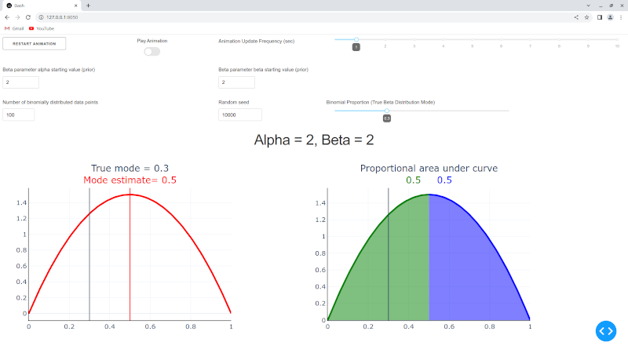
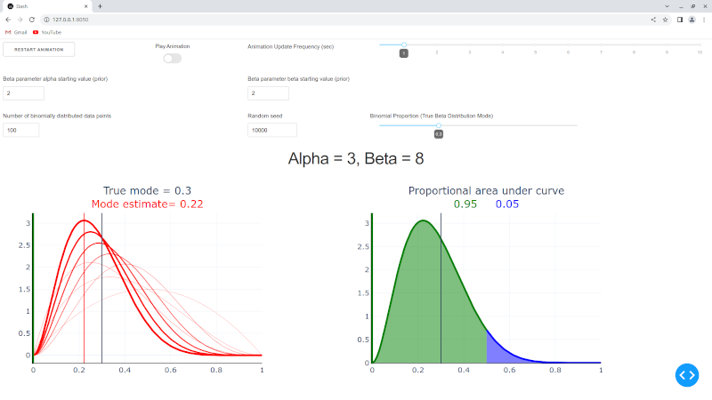
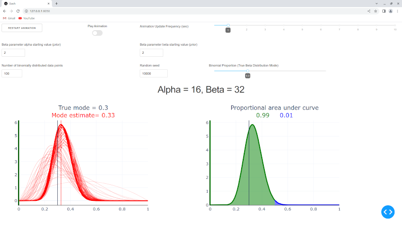

# Bayesian Beta-Binomial Updates:  Plotly Dash Application

The code in this repository runs a [Plotly Dash](https://dash.plotly.com/) app that animates a series of Bayesian updates of [beta distributions with binomial data](https://en.wikipedia.org/wiki/Beta-binomial_distribution)

Application controls:

- Restart Animation - reset the animation to its first state, when only the starting prior beta distribution is displayed
- Play Animation - toggles the animation on or off; 'off' pauses the animation at its current state
- Animation Update Frequency (sec) - the animation updates once every X seconds, where X is chosen here
- Beta parameter alpha starting value (prior) - the starting value for the [beta parameter alpha](https://en.wikipedia.org/wiki/Beta_distribution)
- Beta parameter beta starting value (prior) - the starting value for the [beta parameter beta](https://en.wikipedia.org/wiki/Beta_distribution)
- Number of binomially distributed data points - how long the sequence of binomial data is, i.e., the number of updates
- Random seed - [pseudo-random seed](https://en.wikipedia.org/wiki/Pseudorandom_number_generator) that allows reproducible results whenever the same seed is chosen
- Binomial Proportion (True Beta Distribution Mode) - the proportion used to generate the [binomially distributed data](https://en.wikipedia.org/wiki/Binomial_distribution)

This [webpage](https://afairless.com/updating-our-predictions-with-new-data-basketball-edition/) shows an example of how the beta-binomial model can be used.  It also shows videos of beta distribution upates from the Plotly Dash applicaton.

Below is a sequence of images showing a series of beta-binomial updates.







## Run with Docker

From the top project directory, you can [run these commands](https://docs.docker.com/get-started/):

```code
sudo docker build -t binomial-docker .

sudo docker run -p 8050:8050 binomial-docker
```

In the commands above, you may substitute a name of your own choosing for ```binomial-docker```.

Then point your web browser at:

http://127.0.0.1:8050/

## Run with Poetry

From the 'src' directory, you can [run these commands](https://python-poetry.org/docs/basic-usage/):

```code
poetry install

poetry shell

python beta_binomial.py
```

Then point your web browser at:

http://127.0.0.1:8050/


